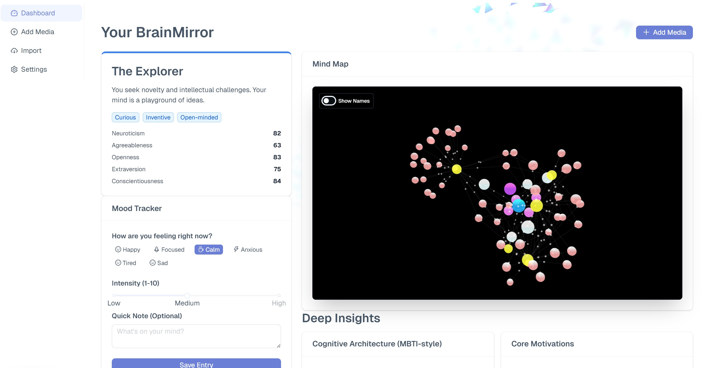

# BrainMirror 🧠✨

**Visualize your mind’s patterns, strengths, and blind spots through the media you love.**

BrainMirror is a modern, psychology-driven web application that builds a "living profile" of your personality based on your media consumption habits (YouTube, Books, Movies, Games) and daily mood. By combining established psychological frameworks (Big Five/OCEAN, Jungian Archetypes, MBTI) with interactive 3D visualizations, BrainMirror helps you understand *why* you like what you like and guides your personal growth.

 *<!-- Replace with actual screenshot if available -->*

## 🌟 Key Features

-   **Psychology-First Onboarding**: Discover your baseline personality using validated scales (Big Five, MBTI-style dichotomies, Cognitive Style, Motivations).
-   **Interactive 3D Mind Map**: Explore your "Taste DNA" in a stunning, force-directed 3D graph where your traits, media, and motivations interconnect like atoms in a molecule.
-   **Living Profile**: Your personality score isn't static. It evolves dynamically as you import data (e.g., YouTube subscriptions) or log daily moods.
-   **Deep Insights Dashboard**: Go beyond simple scores with radar charts, cognitive style breakdowns, and narrative archetypes (e.g., "The Explorer", "The Creator").
-   **Automated Integrations**: Import your YouTube subscriptions to instantly populate your graph with psychologically tagged content.
-   **Mood Tracking**: Log your emotional state to see how it correlates with your personality shifts over time.
-   **Privacy-Focused**: You own your data. Export it anytime or delete your account permanently.

## 🛠️ Tech Stack

-   **Framework**: [Next.js 16](https://nextjs.org/) (App Router)
-   **Language**: [TypeScript](https://www.typescriptlang.org/)
-   **UI Library**: [Ant Design 5](https://ant.design/) + [Tailwind CSS](https://tailwindcss.com/)
-   **Backend & Auth**: [Firebase](https://firebase.google.com/) (Authentication, Firestore)
-   **Visualization**:
    -   `react-force-graph-3d` & `three.js` for the Mind Map.
    -   `@ant-design/charts` for statistical insights.
    -   `vanta.js` for immersive background effects.
-   **State Management**: React Context API

## 🚀 Getting Started

### Prerequisites

-   Node.js (v18+ recommended)
-   Yarn or npm
-   A Firebase project

### Installation

1.  **Clone the repository:**
    ```bash
    git clone https://github.com/yourusername/brain-mirror.git
    cd brain-mirror
    ```

2.  **Install dependencies:**
    ```bash
    yarn install
    ```

3.  **Configure Environment Variables:**
    Create a `.env.local` file in the root directory and add your Firebase configuration:

    ```env
    NEXT_PUBLIC_FIREBASE_API_KEY=your_api_key
    NEXT_PUBLIC_FIREBASE_AUTH_DOMAIN=your_project_id.firebaseapp.com
    NEXT_PUBLIC_FIREBASE_PROJECT_ID=your_project_id
    NEXT_PUBLIC_FIREBASE_STORAGE_BUCKET=your_project_id.appspot.com
    NEXT_PUBLIC_FIREBASE_MESSAGING_SENDER_ID=your_sender_id
    NEXT_PUBLIC_FIREBASE_APP_ID=your_app_id
    NEXT_PUBLIC_FIREBASE_MEASUREMENT_ID=your_measurement_id
    ```

    *Note: You need to enable **Authentication** (Google Provider) and **Firestore Database** in your Firebase Console.*

4.  **Run the development server:**
    ```bash
    yarn dev
    ```

5.  **Open the app:**
    Navigate to [http://localhost:3000](http://localhost:3000) in your browser.

## 📂 Project Structure

```
src/
├── app/                 # Next.js App Router pages
│   ├── dashboard/       # Main user dashboard
│   ├── onboarding/      # Psychology quiz flow
│   ├── import/          # YouTube data import
│   └── ...
├── components/          # Reusable UI components
│   ├── MindMap.tsx      # 3D Force Graph implementation
│   ├── MoodTracker.tsx  # Mood logging component
│   └── ...
├── lib/                 # Core logic & utilities
│   ├── firebase.ts      # Firebase initialization
│   ├── firestoreUtils.ts# Database CRUD operations
│   ├── psychologyUtils.ts # Scoring algorithms & archetypes
│   └── graphUtils.ts    # Data transformation for 3D graph
├── theme/               # Ant Design theme configuration
└── types/               # TypeScript declarations
```

## 🧠 Psychological Frameworks Used

-   **OCEAN (Big Five)**: Openness, Conscientiousness, Extraversion, Agreeableness, Neuroticism.
-   **MBTI-style Dichotomies**: Introversion/Extraversion, Sensing/Intuition, Thinking/Feeling, Judging/Perceiving.
-   **Archetypes**: 5 Core archetypes derived from trait combinations (Explorer, Sentinel, Diplomat, Analyst, Creator).

## 🤝 Contributing

Contributions are welcome! Please feel free to submit a Pull Request.

## 📄 License

This project is licensed under the MIT License - see the [LICENSE](LICENSE) file for details.
